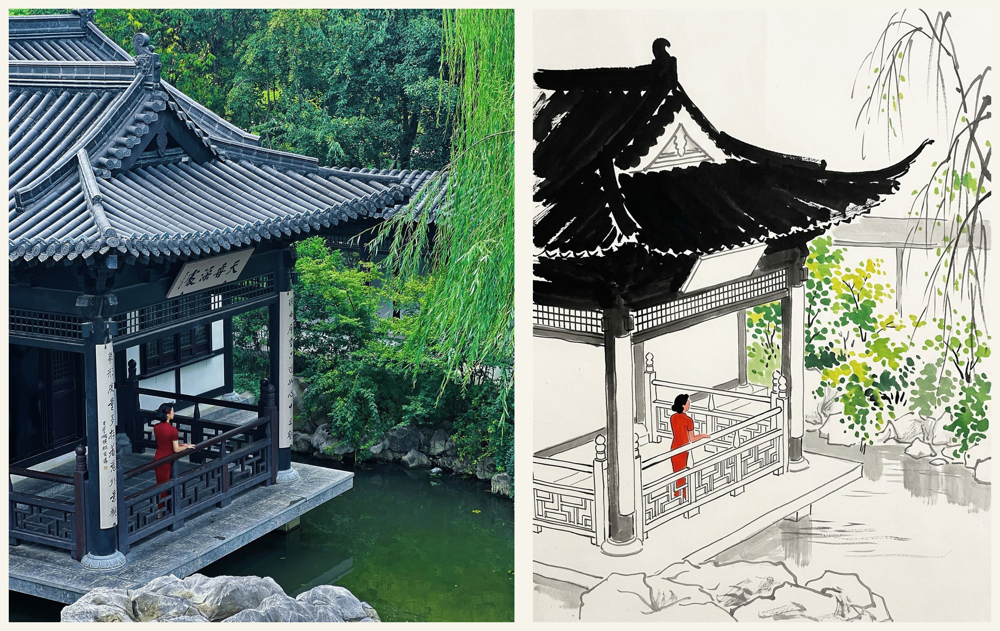
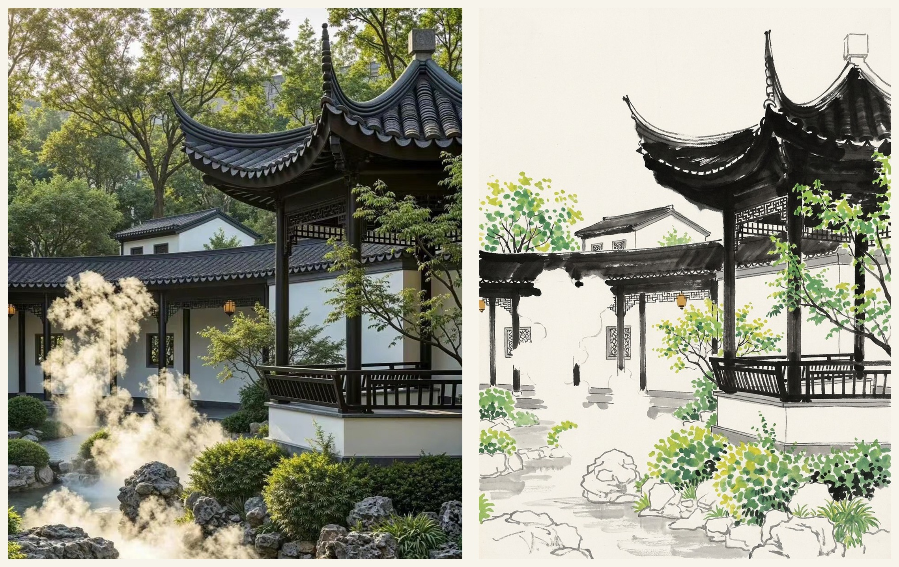
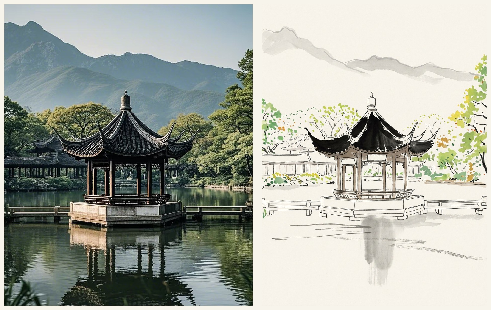

# 吴冠中水墨转译 · Wu Guanzhong Ink Translate

把一张实拍照片转译成吴冠中笔下的水墨画。

这不是滤镜，不是纹理叠加，也不是"照片加个宣纸背景"。它把照片当作**构图来源**整幅重画，输出一张真正的笔墨作品——浓黑瓦、纯留白的白墙、游走的墨线、成簇的彩点。

A Codex / Claude Code / Mavis skill that repaints a photograph as an authentic
Wu Guanzhong (吴冠中, 1919–2010) Chinese ink-and-color painting.

---

## 效果 · Examples

左为实拍原片，右为转译结果。

**临水亭 · 倚栏** — 旗袍女子化为吴冠中标志性的那一点红



**廊庑 · 云雾** — 雾气不上白粉，直接留白



**湖心亭 · 远山** — 远山压成淡灰平涂，天空全空



---

## 使用方法 · Usage

### 作为 skill 使用

1. 把整个仓库文件夹复制到你的 skills 目录：

   | 工具 | 路径 |
   |---|---|
   | Claude Code | `~/.claude/skills/wuguanzhong-ink-translate/` |
   | Codex | `~/.codex/skills/wuguanzhong-ink-translate/` |
   | Mavis | `~/.minimax/agents/<agent>/skills/wuguanzhong-ink-translate/` |

2. 开一个新对话，上传照片，直接说：

   > 用吴冠中 skill 把这张照片转成水墨画

### 只想要提示词

不装 skill 也能用。打开 [`references/style-routes.md`](references/style-routes.md)，
复制其中一条路线的提示词，连同你的照片一起喂给任意图生图模型即可。

---

## 三种风格路线 · Three Style Routes

吴冠中本人的语言不止一套。仓库里固化了三条，都对着他的真迹校准过：

| 路线 | 参考原作 | 特征 | 适用题材 |
|---|---|---|---|
| **A · 江南水乡**（默认） | 《鲁迅故乡》《闹人春色谁家院》 | 浓黑瓦 + 纯白墙 + 细墨线 + 绿彩点，最好读 | 园林、亭台、粉墙黛瓦、水乡 |
| **B · 狮子林** | 《狮子林》 | 游走墨线撑骨架 + 大片灰白块面 + 密集墨点 | 太湖石、繁密植被、层次复杂的场景 |
| **C · 双燕** | 《双燕》 | 极端黑白、细长墨脊、绝对留白、灰水垂影 | 白墙建筑配水面倒影、极简构图 |

拿不准就用 A。

---

## 几条关键规则 · Non-negotiables

这几条是"像吴冠中"和"像普通水墨滤镜"的分界线，改提示词时别动：

- **黑要窄而烈，不是大面积铺开。** 屋脊是一道细长浓黑带，门窗是纯黑窄竖条。黑块一厚，画面立刻发浊。
- **白墙是零处理的空白纸。** 不打调子、不加纹理、不做渐变，只靠一根细线和上方的黑把它框出来。
- **色彩是少数派。** 墨黑 / 灰 / 纸白撑起整张画，朱红、汁绿、藤黄只做点缀。
- **彩点必须是笔触，不能是圆点。** 泪滴形、逗号形、边缘有渗色、大小不匀。规整的正圆一出现，立刻读成塑料贴纸。
- **留白是承重结构。** 江南路留白 ≥45%，抽象两路 ≥60%。
- **风筝不断线。** 抽象是减法减出来的，物象必须还认得出。认不出了就是减过头。

---

## 目录结构 · Structure

```
.
├── SKILL.md                        # 执行流程与约束
├── references/
│   ├── style-routes.md             # 三条路线的完整提示词
│   └── acceptance.md               # 逐条视觉验收清单
├── scripts/
│   └── make_plate.py               # 生成左右对照拼版
└── assets/examples/                # 示例图
```

---

## 对照拼版脚本 · Comparison Plate

默认就是最终交付的版式：左原图、右水墨，中间一道白边作分隔，
外边距收紧，不要任何文字标签。

```bash
python3 scripts/make_plate.py -o out.jpg \
    --panel photo.jpg \
    --panel ink.png
```

如果想加文字标签或主标题（默认不要），用冒号分隔：

```bash
python3 scripts/make_plate.py -o out.jpg \
    --panel "photo.jpg:实拍原片:photograph" \
    --panel "ink.png:江南水乡路:after Wu · Jiangnan" \
    --title "吴冠中笔下的江南"
```

需要 Pillow。Windows 上用 `python`，并用 `--font` 指定中文字体
（如 `C:\Windows\Fonts\simsun.ttc`）。

---

## 已知问题 · Known Issues

- **匾额楹联会被编造成假汉字。** 提示词里已经强制要求把匾额处理成空白木牌，
  但个别模型仍可能画出似字非字的笔画。出图后请放大检查匾额区域。
- **过于繁复的照片容易转成插画感**，丢掉笔墨的松弛。建议挑构图干净、
  黑白关系明确的照片。
- 人脸、文字、logo 都不适合这套流程——它们会在重绘中被破坏。

---

## 关于风格 · A Note on Style

吴冠中提出"风筝不断线"：作品可以飞得很高很抽象，但那根连着现实生活的线不能断。
这套 skill 遵循同一条原则——它把照片减到只剩点、线、面和黑白灰的节奏，
但始终让你认得出原来那个地方。

本仓库是对其绘画语言的学习与致敬，生成结果为 AI 作品，与画家本人及其版权作品无关。

---

## License

MIT
